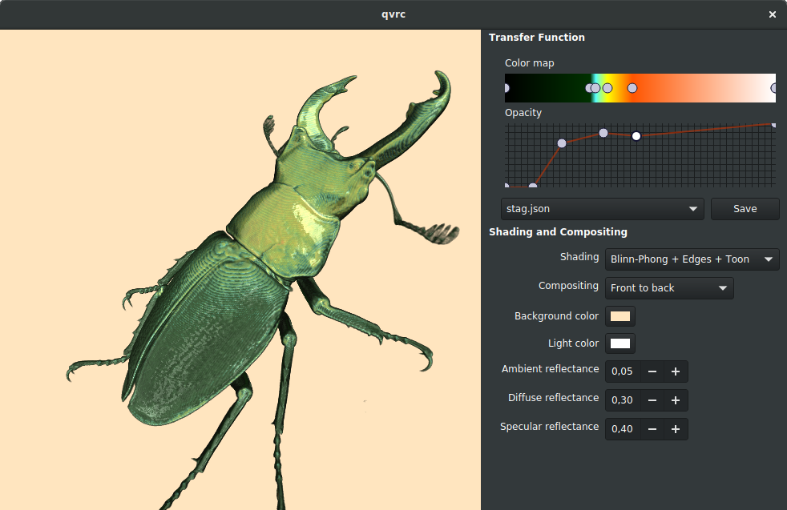

# qvrc #
# another GLSL volume raycaster #
## *and not a particularly good one* ##

Nothing fancy, just basic ray casting with 1D transfer functions and
Blinn-Phong shading. University assignment on scientific/medical
visualization.

## what it does ##

* two-pass bounding box rasterization
* opacity correction
* early ray termination
* blinn-phong shading
* edge enhancement + toon shading

## what's missing ##

* pre-integrated transfer functions
* higher order interpolation
* higher order gradient estimation (sobel?)
* optimizations (octree, adaptive sampling)
* properly designed tf widget
* **basically everything**

## building ##

```
qmake -f Makefile qvrc.pro
make
```

## usage ##

```
./qvrc --help
Usage: ./qvrc [options]
GLSL Volume Raycasting

Options:
  -h, --help                             Displays this help.
  -v, --version                          Displays version information.
  -f, --filename <path/to/filename.raw>  Raw volumetric data filename
  -s, --size <width,height,depth>        Voxel data size
  -x, --scale <xscale,yscale,zscale>     Voxel scale / aspect ratio
  -d, --bitdepth <8,10,12,16>            Voxel bit depth


./qvrc -f datasets/dataset-stagbeetle-416x416x247.dat -s 416,416,247 -d 12 -x 1.0,1.0,0.68
```

## screenshot


## about Qt, and C++ ##

Picked Qt because I needed multiplatform GL and some minimal
GUI. Never did anything with it before (I'm a gtk+ guy), or C++ FWIW,
and it was *way out of my comfort zone*. Still trying to understand
what gets copied and what not. Still trying to accept all those stack
allocations and class global variables.  So... forgive the shitty
code.
